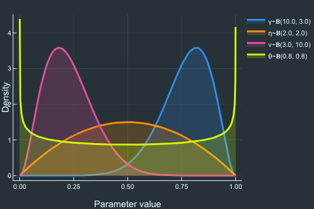

## DynarePriors

  - Function **DynarePriors.jl** allows you to get a feel of the priors you elicit to discipline the likelihood, for all distributions currently allowed in Dynare (4.5.7).  All you need to do is plug your priors into distribution-specific dictionaries, following the examples in the file! 
  - **To-do list**: Map moments into shape and scale parameters; Automate plotting of generalised distributions once standardised distribution support is specified.

 
