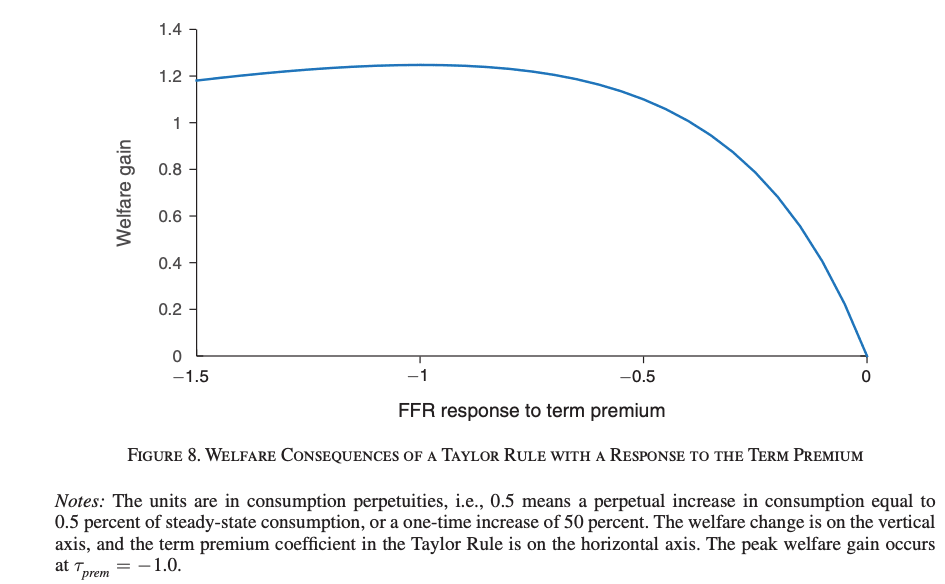

## Welfare\_Evaluation

  - File **welfare_evaluation.m** illustrates how to search for the parameter value that maximizes unconditional welfare, compute the consumption equivalent variation, and plot the results for welfare evaluation. 
  - If you want to know how consumption equivalent variation works and how to interpret it, 
  you can read my explanation [here](https://forum.dynare.org/t/consumption-equivalence-welfare-analysis/14268).
    - An example from Carlstrom et al. (2017) [Targeting Long Rates in a Model with Segmented Markets (2017)](https://www.aeaweb.org/articles?id=10.1257/mac.20150179) is given below: they compare welfare outcomes across a range of coefficient values in the feedback coefficient to the term premium premium in the Taylor rule.
 